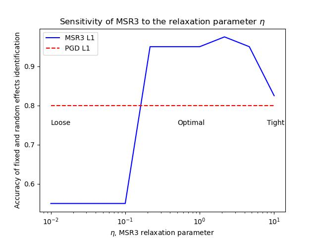

## MSR3 Reproducibility Guide

This notebook (**walkthrough.ipynb**) explains how to reproduce our results from [Sholokhov et. al. (2022): "A Relaxation Approach to Feature Selection for Linear Mixed Effects Models"](https://arxiv.org/abs/2205.06925?context=stat).

This repository only contains the code that uses [pysr3](https://github.com/aksholokhov/pysr3) library to produce figures and tables from the paper above. To learn more about pysr3 go here: [quickstart](https://github.com/aksholokhov/pysr3), [documentation](https://aksholokhov.github.io/pysr3/), [models overview](https://aksholokhov.github.io/pysr3/models_overview.html).

In our research group we take reproducibility seriously. Please open an issue in this repository if you can not reproduce our results with this notebook. We developed it using our current best knowledge on reproducibility which is imperfect and evolves as we receive more feedback.

## Installation

First, checkout this repo

`git clone https://github.com/aksholokhov/msr3-paper`

You'll need to open **walkthrough.ipynb** -- this jupyter notebook. 

As of today, the code works with any version of python starting 3.8.11.

You need to install the following packages to your python environment to run this notebook:
  - pysr3>=0.3.4
  - pandas
  - dask
  - distributed
  - matplotlib
  - seaborn
  - tqdm
  - rpy2

Alternatively, you can use our *environment.yml* to create a new clean environment (**recommended**):

Execute the lines below in your terminal

`conda env create -f environment.yml`

`conda activate msr3-paper`

`python -m ipykernel install --user --name msr3`

Now in the menu above (Kernel->Change Kernel) you should be able to change your Jupyter Kernel to "msr3" that has all the necessary packages installed


```python
%matplotlib auto
```

    Using matplotlib backend: <object object at 0x7fd134d98600>


## Usage

Most of the results can be replicated by running **generate_all.py** with different input parameters. Let's take a look at them:


```python
%run generate_all.py --help
```

    usage: pysr3 experiments [-h] [--experiments EXPERIMENTS] [--models MODELS]
                             [--trials_from TRIALS_FROM] [--trials_to TRIALS_TO]
                             [--use_dask USE_DASK]
                             [--n_dask_workers N_DASK_WORKERS]
                             [--random_seed RANDOM_SEED]
                             [--base_folder BASE_FOLDER]
                             [--experiment_name EXPERIMENT_NAME]
                             [--add_timestamp ADD_TIMESTAMP]
                             [--worker_number WORKER_NUMBER]
                             [--draw_benchmark_data DRAW_BENCHMARK_DATA]
                             [--verbose VERBOSE] [--num_covariates NUM_COVARIATES]
                             [--correlation_between_adjacent_covariates CORRELATION_BETWEEN_ADJACENT_COVARIATES]
                             [--groups_sizes GROUPS_SIZES]
                             [--true_coefs_min TRUE_COEFS_MIN]
                             [--true_coefs_max TRUE_COEFS_MAX]
                             [--fit_fixed_intercept FIT_FIXED_INTERCEPT]
                             [--fit_random_intercept FIT_RANDOM_INTERCEPT]
                             [--obs_var OBS_VAR] [--distribution {normal,uniform}]
                             [--elastic_eps ELASTIC_EPS]
                             [--initializer INITIALIZER]
                             [--logger_keys LOGGER_KEYS] [--tol_oracle TOL_ORACLE]
                             [--tol_solver TOL_SOLVER]
                             [--take_only_positive_part TAKE_ONLY_POSITIVE_PART]
                             [--take_expected_value TAKE_EXPECTED_VALUE]
                             [--max_iter_oracle MAX_ITER_ORACLE]
                             [--max_iter_solver_pgd MAX_ITER_SOLVER_PGD]
                             [--max_iter_solver_sr3 MAX_ITER_SOLVER_SR3]
                             [--fixed_step_size FIXED_STEP_SIZE]
                             [--eta_min ETA_MIN] [--eta_max ETA_MAX]
                             [--eta_num_evals ETA_NUM_EVALS]
                             [--information_criterion_for_model_selection INFORMATION_CRITERION_FOR_MODEL_SELECTION]
    
    optional arguments:
      -h, --help            show this help message and exit
      --experiments EXPERIMENTS
                            Which experiments to run. List them as one string
                            separated by commas, e.g. "L0,L1". Choices: intuition,
                            L0, L1, ALASSO, SCAD, competitors, bullying
      --models MODELS       Which models to include to trials
      --trials_from TRIALS_FROM
                            Each "trial" represents testing all algorithms listed
                            in "experiments" (except intuition and bullying) on
                            one synthetic problem. This parameter and trials_to
                            define bounds. E.g. trials_from=1 (inclusive) and
                            trials_to=5 (exclusive) means that all algorithms will
                            be tested on 4 problems.
      --trials_to TRIALS_TO
                            Each "trial" represents testing all algorithms listed
                            in "experiments" (except intuition and bullying) on
                            one synthetic problem. This parameter and trials_to
                            define bounds. E.g. trials_from=1 (inclusive) and
                            trials_to=5 (exclusive) means that all algorithms will
                            be tested on 4 problems.
      --use_dask USE_DASK   Whether to use Dask Distributed to parallelize
                            experimens. Highly recommended.
      --n_dask_workers N_DASK_WORKERS
                            Number of Dask workers. Defaults to the number of your
                            CPUs - 1.
      --random_seed RANDOM_SEED
                            Experiments-wide random seed.
      --base_folder BASE_FOLDER
                            Path to the base folder (where this file is).
      --experiment_name EXPERIMENT_NAME
                            Name for this run. This script will create a folder
                            named "results/experiment_name" where it will put all
                            outputs of the experiments.
      --add_timestamp ADD_TIMESTAMP
                            Whether to add timestamp to experiment_name. Prevents
                            overwriting your previous outputs when launching this
                            script more than once.
      --worker_number WORKER_NUMBER
                            [For SLURM environment] Then number of this worker in
                            SLURM array. Do not confuse it with n_dask_workers:
                            the former is for parallelizing the trials over
                            multiple nodes (e.g. on a SLURM cluster), the latter
                            is for parallelizing experiments for one trial within
                            one node.
      --draw_benchmark_data DRAW_BENCHMARK_DATA
                            Whether to produce the plots and benchmark tables
                            after the experiments are done executing. Must be
                            False when using SLURM.
      --verbose VERBOSE     Whether to print log and progress messages or execute
                            silently.
      --num_covariates NUM_COVARIATES
                            Number of covariates for synthetic problems
      --correlation_between_adjacent_covariates CORRELATION_BETWEEN_ADJACENT_COVARIATES
                            Correlations between adjacent pairs of covariates.
      --groups_sizes GROUPS_SIZES
                            Group sizes
      --true_coefs_min TRUE_COEFS_MIN
                            Magnitude of the smallest coefficient
      --true_coefs_max TRUE_COEFS_MAX
                            Magnitude of the largest coefficient
      --fit_fixed_intercept FIT_FIXED_INTERCEPT
                            Whether to add the intercept as a fixed effect
      --fit_random_intercept FIT_RANDOM_INTERCEPT
                            Whether to add the intercept as a random effect
      --obs_var OBS_VAR     Variance of the observations
      --distribution {normal,uniform}
                            Distribution for generating features (covariates)
      --elastic_eps ELASTIC_EPS
                            L2 regularization coefficient to ensure convexity of
                            the relaxed problem
      --initializer INITIALIZER
                            How to initialize model coefficients. Options: EM - do
                            one iteration of EM algorithm, or None -- start with
                            all ones.
      --logger_keys LOGGER_KEYS
                            Which quantities should the model record during
                            training.
      --tol_oracle TOL_ORACLE
                            [For SR3] Tolerance for SR3 oracle's internal
                            numerical subroutines
      --tol_solver TOL_SOLVER
                            Tolerance for the stop criterion of PGD solver
      --take_only_positive_part TAKE_ONLY_POSITIVE_PART
                            [For SR3] Whether to use only the positive part of the
                            Hessian to avoid negative Hessians.
      --take_expected_value TAKE_EXPECTED_VALUE
                            [For SR3] Whether to use the expected value of the
                            Hessian to avoid negative Hessians.
      --max_iter_oracle MAX_ITER_ORACLE
                            [For SR3] Maximum number of iterations for the SR3
                            oracle's numerical subroutines.
      --max_iter_solver_pgd MAX_ITER_SOLVER_PGD
                            Maximum number of iterations for the PGD solver
      --max_iter_solver_sr3 MAX_ITER_SOLVER_SR3
                            [For SR3] Maximum number of iterations for the PGD
                            solver.
      --fixed_step_size FIXED_STEP_SIZE
                            Size of the fixed step-size for PGD solver
      --eta_min ETA_MIN     [For SR3] Left boundary (in Log10) for grid search
                            over eta -- the SR3 relaxation parameter
      --eta_max ETA_MAX     [For SR3] Right boundary (in Log10) for grid search
                            over eta -- the SR3 relaxation parameter
      --eta_num_evals ETA_NUM_EVALS
                            [For SR3] Number of uniformly-sampled grid-search
                            points for eta
      --information_criterion_for_model_selection INFORMATION_CRITERION_FOR_MODEL_SELECTION
                            Which information criterion to use for the final model
                            selection. Options: jones, vaida, muller.


For the reproducibility purposes the most important ones are:
- **experiment_name**: name for the current run. The script will create folders named 'results/experiment_name/{logs,figures,tables}' where it will place the resulting training logs, figures, and tables respectively.
- **experiments**: which experiments to run. List them as one string separated by commas, e.g. "L0,L1". Choices: intuition, L0, L1, ALASSO, SCAD, competitors, bullying
- **trials_from** and **trials_to**: how many synthetic problems do we use to compare the performance of our methods (for L0, L1, ALASSO, SCAD, and competitors)

### 1. Intuition picture (Figure 3)

This picture can be generated via the command below. It executes in a single-thread and takes about 8 minutes on my MacBook Pro 2019. The majority of this time goes into evaluating the value function on a fine gid to draw the level-sets.

The code that executes this experiment is located in **intuition.py**


```python
%time %run generate_all.py --experiments "intuition"
```

    Creating a folder for the experiments' outputs: results/test_run
    This run's input parameters are saved as: 
     results/test_run/logs/experiment_inputs_1.pickle
    Generate data and fit models for the 'intuition' experiment (Figure 3)
    On a 2D sample L1 problem PGD took 1284 steps to converge and MSR3 took 18 steps to converge.


    Evaluating value function for betas on a grid for contour plots: 100%|█████████████████████████████████████████████████████████████████████████████████████████████████████████████| 100/100 [04:06<00:00,  2.47s/it]
    Evaluating value function for gammas on a grid for contour plots: 100%|████████████████████████████████████████████████████████████████████████████████████████████████████████████| 100/100 [03:30<00:00,  2.11s/it]


    Intuition data saved as results/test_run/logs/log_intuition.pickle
    Intuition figure (Figure 2) saved as results/test_run/figures/intuition.jpg
    CPU times: user 7min 46s, sys: 714 ms, total: 7min 47s
    Wall time: 7min 47s


This is what I got:


### 2. Performance comparison

This experiment reproduces the Table 2 and Figure 4 from the paper. They compare the performance of PGD against MSR3 and MSR3-fast on a set of synthetic examples. In our paper we ran the experiments on 100 problems which took *240 CPU-hours* on our SLURM cluster. The main reason for why it takes so long is that the reference algorithms (PGD and MSR3) are quite slow: they need to be evaluated on a grid of 10 points for the regularization parameter $\lambda$, times another 10 points for the relaxation parameter $\eta$ for MSR3, all of that for 4 different regularizers (L0, L1, ALASSO, SCAD). With each of them taking 40 seconds on average they amount to (1+10)*10*4 = 300 minutes of CPU-time *per problem*, or trial. Our proposed algorithm MSR3-fast takes a tiny fraction (~1/400) of this time with its average execution time of 100 milliseconds.

Thus, your options are:
1. *Run it on a SLURM cluster (**preferred**)*: This is what we did. When running 100 problems in parallel the experiment took about 2 hours. You can use the provided file **run_on_slurm.bash** for it. Don't forget to adjust the username and the partition name to match your environment.
2. *Run it on a multicore computer with Dask*: 16 workers in parallel take about 20 hours to complete the experiments on my Intel Core i9-9980K. **NB**: you may be asked to allow incoming network connections to python.
3. *Run it on a smaller number of problems*: Running it for e.g. 3 problems won't probably give you the exact same numbers as we got in the paper due to larger variation, but it should be enough to see the overall pattern.
4. *Run only MSR3-fast*: It should be enough if you want to benchmark only our proposed algorithm. You'll need to edit *generate_all.py* for it.

**NB1**: another big reason to run the code on SLURM is resource isolation per process.
- When you run your code in SLURM you ensure the execution time is measured correctly, as no other heavy processes are being executed in parallel.
- When you run your code on your local machine your processes interfere with the system processes and with each other. It introduces a time-dependent noise in your measurements that is hard to predict and is nearly impossible to get rid of. In past the system process could have been assumed brief and non-influential, but nowadays modern consumer PCs run heavy background processes such as photo processing, indexing, and caching, that could take multiple cores out of your resource pool and skew the measurements for one algorithm or all of them.

**NB2**: The script also saves all **datasets** as csv-files in *results/experiment_name/synthetic_data*


```python
%time %run generate_all.py --experiments "L0,L1,ALASSO,SCAD" --trials_from 1 --trials_to 2 
```

    Creating a folder for the experiments' outputs: results/test_run
    This run's input parameters are saved as: 
     results/test_run/logs/experiment_inputs_1.pickle
    
    Run comparison experiment for L0-based selection benchmark (Table 2, Figure 4). Problems to solve: [1, 2)
    Jobs to process: 21
    Processing with Dask.Distributed, with 15 workers in parallel.


    21it [59:11, 169.14s/it]


    L0 log saved to: 
     results/test_run/logs/L0_1.log
    
    Run comparison experiment for L1-based selection benchmark (Table 2, Figure 4). Problems to solve: [1, 2)
    Jobs to process: 21
    Processing with Dask.Distributed, with 15 workers in parallel.


    21it [06:39, 19.03s/it]


    L1 log saved to: 
     results/test_run/logs/L1_1.log
    
    Run comparison experiment for ALASSO-based selection benchmark (Table 2, Figure 4). Problems to solve: [1, 2)
    Jobs to process: 21
    Processing with Dask.Distributed, with 15 workers in parallel.


    21it [25:15, 72.18s/it] 


    ALASSO log saved to: 
     results/test_run/logs/ALASSO_1.log
    
    Run comparison experiment for SCAD-based selection benchmark (Table 2, Figure 4). Problems to solve: [1, 2)
    Jobs to process: 21
    Processing with Dask.Distributed, with 15 workers in parallel.


    21it [38:33, 110.19s/it]


    SCAD log saved to: 
     results/test_run/logs/SCAD_1.log


    /Users/aksh/Storage/repos/msr3-paper/comparison_table.py:164: FutureWarning: The frame.append method is deprecated and will be removed from pandas in a future version. Use pandas.concat instead.
      plots_data = plots_data.append(mean_df)
    /Users/aksh/Storage/repos/msr3-paper/comparison_table.py:164: FutureWarning: The frame.append method is deprecated and will be removed from pandas in a future version. Use pandas.concat instead.
      plots_data = plots_data.append(mean_df)
    /Users/aksh/Storage/repos/msr3-paper/comparison_table.py:164: FutureWarning: The frame.append method is deprecated and will be removed from pandas in a future version. Use pandas.concat instead.
      plots_data = plots_data.append(mean_df)
    /Users/aksh/Storage/repos/msr3-paper/comparison_table.py:164: FutureWarning: The frame.append method is deprecated and will be removed from pandas in a future version. Use pandas.concat instead.
      plots_data = plots_data.append(mean_df)


    CPU times: user 9min 24s, sys: 3min 46s, total: 13min 10s
    Wall time: 10h 49s


    /Users/aksh/Storage/repos/msr3-paper/comparison_table.py:244: FutureWarning: In future versions `DataFrame.to_latex` is expected to utilise the base implementation of `Styler.to_latex` for formatting and rendering. The arguments signature may therefore change. It is recommended instead to use `DataFrame.style.to_latex` which also contains additional functionality.
      table_short.to_latex(experiment_folder / "tables" / f"performance_table_short.tex", escape=False)
    /Users/aksh/Storage/repos/msr3-paper/comparison_table.py:245: FutureWarning: In future versions `DataFrame.to_latex` is expected to utilise the base implementation of `Styler.to_latex` for formatting and rendering. The arguments signature may therefore change. It is recommended instead to use `DataFrame.style.to_latex` which also contains additional functionality.
      table_short[['PGD', 'MSR3-fast']].to_latex(experiment_folder / "tables" / f"performance_table_short_wo_msr3.tex",
    /Users/aksh/Storage/repos/msr3-paper/comparison_table.py:248: FutureWarning: In future versions `DataFrame.to_latex` is expected to utilise the base implementation of `Styler.to_latex` for formatting and rendering. The arguments signature may therefore change. It is recommended instead to use `DataFrame.style.to_latex` which also contains additional functionality.
      table_long.to_latex(experiment_folder / "tables" / f"performance_table_long.tex")


Here is what I got for just one problem:


```python
import pandas as pd
pd.read_csv('results/test_run/tables/performance_table_short.csv')
```


<div>
<table border="1" class="dataframe">
  <thead>
    <tr style="text-align: right;">
      <th></th>
      <th>Regilarizer</th>
      <th>Metric</th>
      <th>PGD</th>
      <th>MSR3</th>
      <th>MSR3-fast</th>
    </tr>
  </thead>
  <tbody>
    <tr>
      <th>0</th>
      <td>L0</td>
      <td>Accuracy</td>
      <td>0.90</td>
      <td>0.95</td>
      <td>0.95</td>
    </tr>
    <tr>
      <th>1</th>
      <td>L0</td>
      <td>Time</td>
      <td>23.18</td>
      <td>109.44</td>
      <td>0.56</td>
    </tr>
    <tr>
      <th>2</th>
      <td>SCAD</td>
      <td>Accuracy</td>
      <td>0.80</td>
      <td>0.95</td>
      <td>0.95</td>
    </tr>
    <tr>
      <th>3</th>
      <td>SCAD</td>
      <td>Time</td>
      <td>50.17</td>
      <td>9.43</td>
      <td>0.75</td>
    </tr>
    <tr>
      <th>4</th>
      <td>L1</td>
      <td>Accuracy</td>
      <td>0.80</td>
      <td>0.95</td>
      <td>0.95</td>
    </tr>
    <tr>
      <th>5</th>
      <td>L1</td>
      <td>Time</td>
      <td>17.37</td>
      <td>10.34</td>
      <td>0.51</td>
    </tr>
    <tr>
      <th>6</th>
      <td>ALASSO</td>
      <td>Accuracy</td>
      <td>0.95</td>
      <td>0.95</td>
      <td>0.95</td>
    </tr>
    <tr>
      <th>7</th>
      <td>ALASSO</td>
      <td>Time</td>
      <td>28.02</td>
      <td>77.06</td>
      <td>0.85</td>
    </tr>
  </tbody>
</table>
</div>


The code also produces sensitivity analysis plot for $\eta$ (Figure 5):



### 3. Bullying example

In this example (Chapter 4.2, Figure 6) we apply our method to Bullying Data from GBD. The goal of the underlying study was to estimate the burden (DALYs) of major depressive disorder (MDD) and anxiety disorders that are caused by bullying.

- The dataset is located in *bullying/bullying_data.csv*
- The code that executes the experiments and produces plots is located in *bullying/bullying_example.py*

The experiment runs quickly on a single-core machine. This is how you run it:


```python
%time %run generate_all.py --experiments "bullying"
```

    Creating a folder for the experiments' outputs: results/test_run
    This run's input parameters are saved as: 
     results/test_run/logs/experiment_inputs_1.pickle
    Run a feature-selection experiment on real-world data from the Bullying study. (Figure 6)


    100%|████████████████████████████████████████████████████████████████████████████████████████████████████████████████████████████████████████████████████████████████████████████████| 12/12 [00:00<00:00, 14.75it/s]


    Random feature selection saved as as results/test_run/figures/bullying_data_random_feature_selection.jpg
    Random feature selection saved as as results/test_run/figures/bullying_data_random_feature_selection.jpg
    Assessment saved as as results/test_run/figures/bullying_data_assessment_selection.jpg
    CPU times: user 8.22 s, sys: 79.5 ms, total: 8.3 s
    Wall time: 8.29 s


Here is what I got:


### 4. Comparison with alternative libraries

We provide python wrappers for four R libraries: **[fence](https://cran.r-project.org/web/packages/fence/index.html)**, **[lmmlasso](https://rdrr.io/cran/lmmlasso/)**, **[glmmlasso](https://cran.r-project.org/web/packages/glmmLasso/index.html)**, and **[pco](https://pubmed.ncbi.nlm.nih.gov/24920875/)** (see in *alterntatives/pco.r*). Each wrapper consists of two files
- *alternatives/name.r*: an R code that runs the library *name* to the provided dataset
- *alternatives/name_wrapper.py* a python code that links the R file above to our experimental pipeline


To run then within our experimental pipeline you need:
- Make sure that you have an R environment installed with the paths to it appropriately linked to the system.
- Install the R packages for the algorithms from the list above.
- Install rpy2 library to your python environment.

As discussed  in the paper, we only report the evaluations for lmmlasso and glmmlasso because
- PCO can not solve problems where the number of random effects (|gamma| * num_groups) exceeds the total number of objects, which is the case for our problem set.
- Fence is too slow and runs out of memory on Macbook Pro 16 with 32GB of RAM.

Nevertheless, we provide the wrappers for all four libraries. If you want to give PCO and Fence another go then you need to uncomment them in the lines 385-390 of *generate_all.py*

Here is how you can launch it:


```python
%time %run generate_all.py --experiments "competitors" --trials_from 1 --trials_to 2 --use_dask 0
```

    Creating a folder for the experiments' outputs: results/test_run
    This run's input parameters are saved as: 
     results/test_run/logs/experiment_inputs_1.pickle
    
     Run experiment for alternative libraries on L1 tasks (Table 3). Problems to solve [1, 2)
    Jobs to process: 12
    Processing in a single thread. Brace yourself, it may take a while... (Consider passing --use_dask for multithread execution)


     92%|█████████████████████████████████████████████████████████████████████████████████████████████████████████████████████████████████████████████████████████████████▎              | 11/12 [00:36<00:06,  6.40s/it]R[write to console]: Loading required package: emulator
    
    R[write to console]: Loading required package: mvtnorm
    
    R[write to console]: Loading required package: miscTools
    
    R[write to console]: Loading required package: penalized
    
    R[write to console]: Loading required package: survival
    
    R[write to console]: Welcome to penalized. For extended examples, see vignette("penalized").
    


    ----------------------------------------------------------------------
    This is a test release of the package 'lmmlasso'. If you have any questions or problems, do not hesitate to contact the author.
    ----------------------------------------------------------------------
    Redundant covariance parameters. 
    Redundant covariance parameters. 
    Redundant covariance parameters. 
    Redundant covariance parameters. 
    Redundant covariance parameters. 
    Redundant covariance parameters. 
    Redundant covariance parameters. 
    Redundant covariance parameters. 
    Redundant covariance parameters. 
    Redundant covariance parameters. 
    Redundant covariance parameters. 
    Redundant covariance parameters. 
    Redundant covariance parameters. 
    Redundant covariance parameters. 
    Redundant covariance parameters. 
    Redundant covariance parameters. 


    100%|████████████████████████████████████████████████████████████████████████████████████████████████████████████████████████████████████████████████████████████████████████████████| 12/12 [02:13<00:00, 11.13s/it]

    Measurements for competitors are saved to: 
     results/test_run/logs/competitors_1.log
    The table with performance comparison for alternative libraries was saved to:results/test_run/tables/competitors_table_long.tex
    CPU times: user 4min 54s, sys: 6.77 s, total: 5min 1s
    Wall time: 2min 13s


    
    /Users/aksh/Storage/repos/msr3-paper/competitors_table.py:79: FutureWarning: In future versions `DataFrame.to_latex` is expected to utilise the base implementation of `Styler.to_latex` for formatting and rendering. The arguments signature may therefore change. It is recommended instead to use `DataFrame.style.to_latex` which also contains additional functionality.
      table_long.to_latex(tables_folder / f"competitors_table_long.tex")


Here is what I got for running it on just one problem:


```python
import pandas as pd
alternatives = pd.read_csv('results/test_run/tables/competitors_table_long.csv')
alternatives
```


<div>
<table border="1" class="dataframe">
  <thead>
    <tr style="text-align: right;">
      <th></th>
      <th>Unnamed: 0</th>
      <th>SR3-L1-P</th>
      <th>glmmLasso</th>
      <th>lmmLasso</th>
    </tr>
  </thead>
  <tbody>
    <tr>
      <th>0</th>
      <td>Accuracy</td>
      <td>95 (95-95)</td>
      <td>45 (45-45)</td>
      <td>72 (72-72)</td>
    </tr>
    <tr>
      <th>1</th>
      <td>FE Accuracy</td>
      <td>95 (95-95)</td>
      <td>45 (45-45)</td>
      <td>45 (45-45)</td>
    </tr>
    <tr>
      <th>2</th>
      <td>RE Accuracy</td>
      <td>95 (95-95)</td>
      <td>45 (45-45)</td>
      <td>100 (100-100)</td>
    </tr>
    <tr>
      <th>3</th>
      <td>F1</td>
      <td>94 (94-94)</td>
      <td>61 (61-61)</td>
      <td>77 (77-77)</td>
    </tr>
    <tr>
      <th>4</th>
      <td>FE F1</td>
      <td>95 (95-95)</td>
      <td>59 (59-59)</td>
      <td>62 (62-62)</td>
    </tr>
    <tr>
      <th>5</th>
      <td>RE F1</td>
      <td>94 (94-94)</td>
      <td>62 (62-62)</td>
      <td>100 (100-100)</td>
    </tr>
    <tr>
      <th>6</th>
      <td>Time</td>
      <td>0.14 (0.14-0.14)</td>
      <td>0.55 (0.55-0.55)</td>
      <td>6.13 (6.13-6.13)</td>
    </tr>
    <tr>
      <th>7</th>
      <td>Iterations</td>
      <td>90 (90-90)</td>
      <td>53 (53-53)</td>
      <td>0 (0-0)</td>
    </tr>
  </tbody>
</table>
</div>


```python

```
